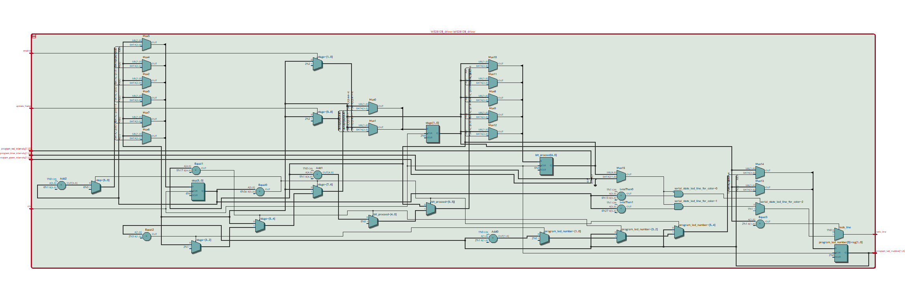

# WS2812B Driver

Manage the serial output signal for the LEDs of type WS2812B.

## Responsabilities :

- Produce a signal compatible with WS2812B Leds
- Deal with a Program component to know how display current led
- Can be triggered with the Activity impulsion

## RTL Architecture 

|  pin input   | input description  |   output description             |  pin output                    |
|  :---   |  :--- | ---:                         |  ---:                    |
|  **clk**  |  50 Mhz clock input signal  |  WS2812B signal transmited to LEDs chain  |  **leds_line**  |
|  **enable**  |  To start the first frame  | Position of the current coded led | **program_led_number[1..0]** |
|  **update_frame**  | HIGH to trigger new data frame  |  | |
|  **program_green_intensity[7..0]**  | 0 to 255 code for Green color  | |  |
|  **program_red_intensity[7..0]**  | 0 to 255 code for Red color  |  |  |
|  **program_blue_intensity[7..0]**  | 0 to 255 code for Blue color  |  |  |
